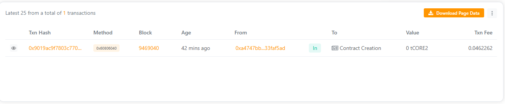

# FinLedger

## 🪙 Project Title
**FinLedger — A Blockchain-Based Financial Ledger**

---

## 🧩 Project Description
FinLedger is a decentralized ledger application built on the Ethereum blockchain using Solidity and Hardhat.  
It allows users to record, view, and track financial transactions securely and transparently without a central authority.

---

## 🌐 Project Vision
To provide a **trustworthy**, **tamper-proof**, and **auditable** digital financial ledger that enhances transparency, accountability, and security in financial operations.

---

## ⚡ Key Features
- 🔗 **Decentralized Ledger:** All transactions are recorded on-chain, ensuring transparency.  
- 🕵️ **Immutable Records:** Once stored, transaction data cannot be altered or deleted.  
- 📊 **Easy Retrieval:** View complete transaction history and counts.  
- 🔒 **Secure and Permissionless:** Anyone can record transactions without intermediaries.

---

## 🚀 Future Scope
- 💰 Integration with real-time token transfers.  
- 🧠 Addition of smart analytics for transaction insights.  
- 📱 Development of a web dashboard for user-friendly access.  
- 🪙 Support for multi-chain deployment (Polygon, BSC).  

---

## 📂 Project Structure

Contract Address - 0xBB55CF4E5e5daa6A60493e1446E302Ce7fB69Cab

